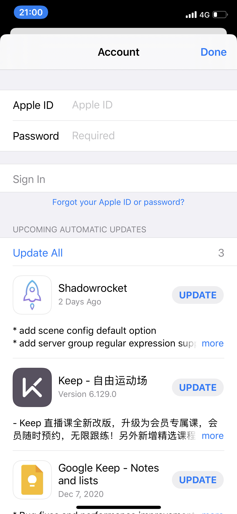
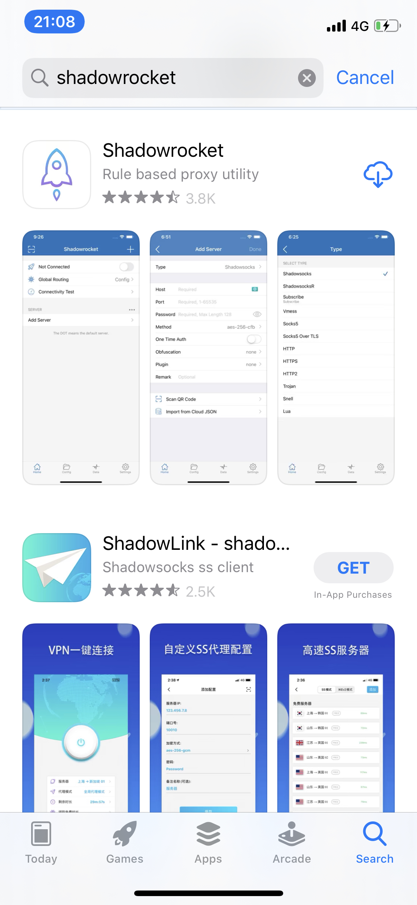
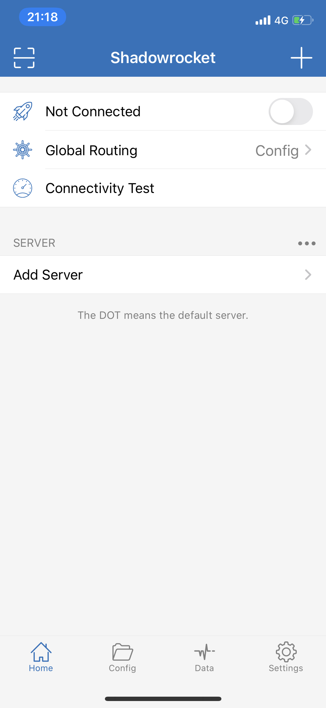
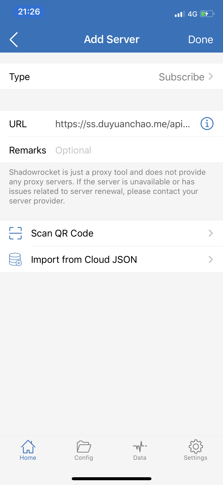
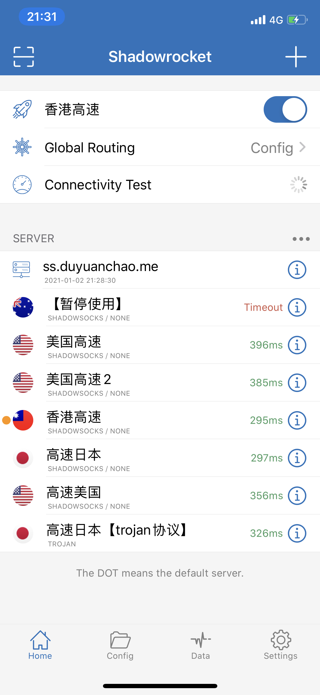

## [购买高速SS节点](https://ss.duyuanchao.me/)
提供高速节点，支持 ss、trojan等协议。支持按月、季度、半年、年付款。

## Shadowrocket 使用教程
这是一款付费软件，需要登陆美区 Apple ID 下载，购买节点提供免费 Apple ID 下载该软件。

## Shadowrocket 使用教程
1. 打开应用商店，点击头像，点击退出账号
2. 登陆美区 Apple ID

3. 搜索 `Shadowsocks` 软件购买下载

4. 打开下载好的 Shadowsocks 并允许所有权限
5. 左上角为扫码二维码图标，最上面的开关打开表示开启VPN，如果没有开启表示关闭VPN。

6. 右上角可以添加节点。可以手动添加不同类型的节点，也支持订阅功能，选择类型为 `订阅(Subscribe)`，然后 URL 填写订阅链接，下面一个 Remark 是订阅的标签，可以不填写。点击完成(Done)就可以添加订阅

7. 点击 `Connectivity Test` 可以测试每个节点的可用性，如果没有显示超时表示可以使用，然后打开开关就可以使用啦。
